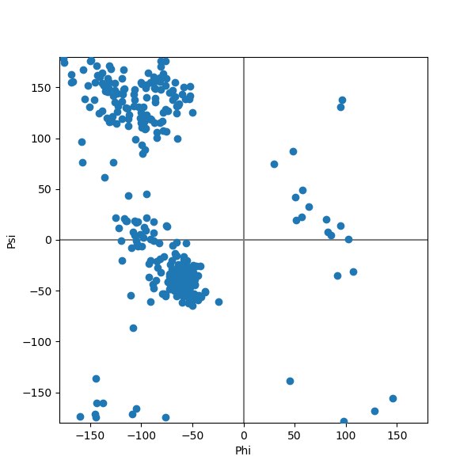
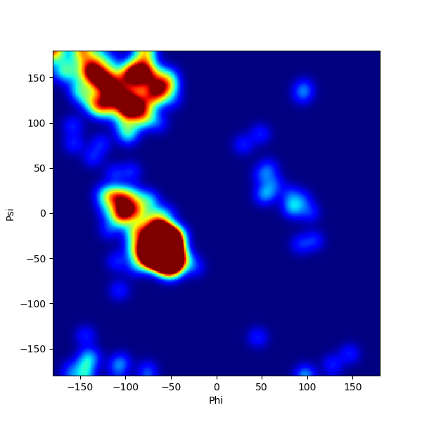
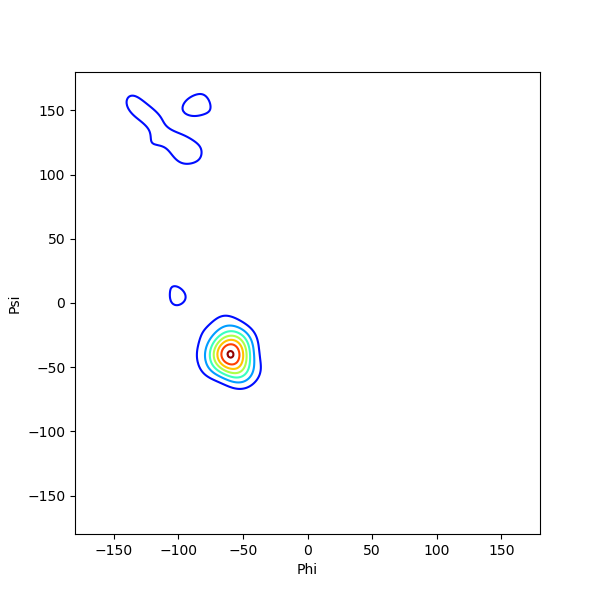

# RamaPlot
##### By Matthew Masters
Simple Python tool to calculate protein dihedral angles and plot them as Ramachandran plots.

### Usage
	input_file = '1atp.pdb'
	protein = read_pdb(input_file)
	dihedrals = get_dihedrals(protein)
	plot_points(dihedrals)
	plot_heatmap(dihedrals)
	plot_contour(dihedrals)

| Points | Heatmap     |   Contour   |
| ---- | ---- | ---- |
|  |      |      |
